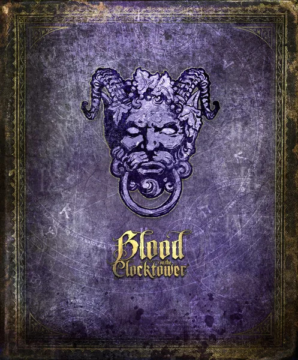

# Brettspiele

Tracking über [Boardgamegeek](https://boardgamegeek.com/), Auswertung per [Geekgroup](https://geekgroup.app)

- 343 Runden gespielt | Jede Woche ⌀ 6.6 Spielrunden

<v-clicks>

- 168 verschiedene Spiele, davon 147 neue
- 13 Spiele mehr als 5 mal gespielt
</v-clicks>

5 Meistgespielten:

  

    
    

bewertet:

8/10

    

gespielt:

22x

  

  
9/10 21x

  
9/10 16x

  
10/10 15x

  
8/10 10x

