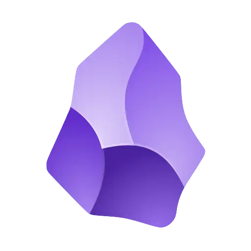

<h1><a target="_blank" rel="noopener noreferrer" href="https://obsidian.md/">Obsidian</a></h1> (Notizen-App)

 
- schnell & strukturiert
- 
Ordner 
→ Tags

→ Suche + Verlinkung

<v-click>
 

- Vergleiche von Soft- und Hardware
- Planung der Sommerfreizeit
- Sammeln von Rezepten (Familie)
- Kurze Notizen, etc.
</v-click>

---
layout: image-left
image: ../assets/img/dips_losteria_neu.gif
---

# L'Osteria

| Name             | Preis | Rating |
| ---------------- | ----- | ------ |
| Caesare e Pollo  | 18,50 | 😍     |
| Zucca e Spinaci  | 14,95 | 😍     |
| Primavera        | ?     | 😍     |
| Nduja Calabrese  | 18,50 | 👍     |
| Quattro Formaggi | 16,95 | 😐     |
| Degli Artisti    | 18,50 | 👎     |
| Marinara         | 18,50 | 👎     |

---
layout: default
---

# Hobbies

<v-clicks>

| Hobby               | **Social** | **Kreativ** | **Wissen** | Draußen | Sport |
| :------------------ | :----: | :-----: | :----: | :-----: | ----- |
| Gaming          |   ➖    |    ❌    |   ➖    |    ❌    | ❌     |
| Fitnessstudio   |   ❌    |    ❌    |   ➖    |    ❌    | ✅     |
| Brettspiele     |   ✅    |    ➖    |   ✅    |    ❌    | ❌     |
| Klavier         |   ➖    |    ✅    |   ✅    |    ❌    | ❌     |
| Tanzen          |   ✅    |    ✅    |   ✅    |    ➖    | ✅     |
| Jugendarbeit    |   ✅    |    ✅    |   ➖    |    ✅    | ➖     |

</v-clicks>

Inspiriert durch YT Johnny Harris's <a target="_blank" rel="noopener noreferrer" href="https://www.youtube.com/watch?v=8uoJNv9ufjM">Video zu Langeweile</a>

    
✅ ja

    
❌ nein
    
    
➖ kommt drauf an

<!-- Hobbies -->